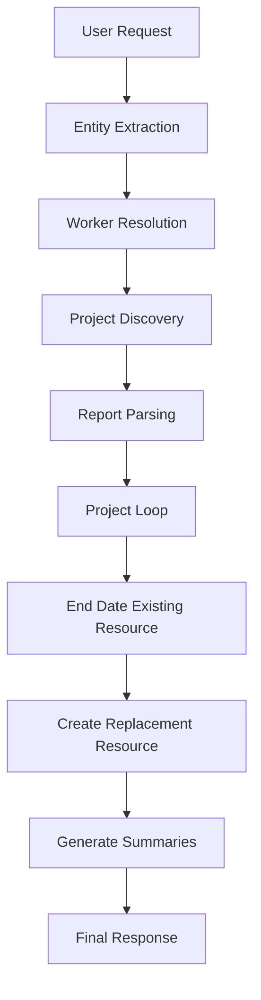

# Oracle Fusion AI Agent Studio – Project Resource Replacement AI Agent

## Overview

The Project Resource Replacement AI Agent is workflow type agent that automates the replacement of project managers across Oracle Fusion Project Management.

The agent identifies an outgoing project resource, discovers all active project assignments, end-dates existing assignments, creates replacement assignments, and generates a consolidated execution summary.

The solution demonstrates enterprise-grade orchestration across Oracle Fusion HCM, Oracle Fusion Project Management, BI Publisher, External REST Services, and Large Language Models (LLMs).

---

## Business Challenge

Organizations frequently encounter scenarios where project resources need to be replaced across multiple active projects:

* Employee exits
* Organizational restructuring
* Resource transitions
* Project manager changes
* Internal mobility
* Workforce reallocation

Performing these updates manually can be time-consuming, error-prone, and difficult to scale.

---

## Solution Highlights

### Natural Language Driven

Users can submit requests such as:

```text
Replace Project Manager John Smith with Sarah Johnson
Swap out Robert Lee for Jennifer Davis
```

### Automatic Project Discovery

The accelerator automatically identifies all impacted projects associated with the outgoing resource.

### Role Preservation

The incoming resource inherits the same project role as the outgoing resource.

### Parallel Processing

Multiple project assignments can be processed simultaneously.

### Human Readable Summaries

The accelerator generates project-level and consolidated execution summaries.

---

## Key Oracle Fusion Components

### Oracle Fusion HCM

* Worker Search

### Oracle Fusion Project Management

* Project Search
* Project Team Member Search
* Project Team Member Update
* Project Team Member Create

### Oracle BI Publisher

* Project Resource Reporting

### Oracle AI Agent Studio

* LLM Orchestration
* Data Pipelines
* Parallel Processing
* Variable Management
* External Tool Integration

---

## Architecture



---

## Oracle AI Agent Studio Patterns Demonstrated

| Pattern                            | Used |
| ---------------------------------- | ---- |
| Natural Language Extraction        | Yes  |
| Worker Details                     | Yes  |
| Business Object Invocation         | Yes  |
| External REST Integration          | Yes  |
| BI Publisher Integration           | Yes  |
| LLM Data Transformation            | Yes  |
| Dynamic Payload Generation         | Yes  |
| Parallel Loop Processing           | Yes  |

---

## Repository Structure

```text
docs/
├── 01-business-overview.md
├── 02-solution-architecture.md
├── 03-process-flow.md
├── 04-technical-design.md
├── 05-ai-design-and-prompts.md
├── 06-api-and-integration-reference.md
├── 07-deployment-guide.md
├── 08-security-governance.md
├── 09-limitations-lessons-learned.md
└── 10-roadmap.md
```

---

## Intended Audience

* Oracle Fusion Consultants
* Oracle Technical Consultants
* Oracle Solution Architects
* Oracle AI Agent Studio Developers
* Customers Evaluating AI Agent Studio
* Oracle Community Members

---

## AI Agent Outcome

The agent reduces manual project administration effort by automating resource replacement activities while maintaining role continuity and project governance.
