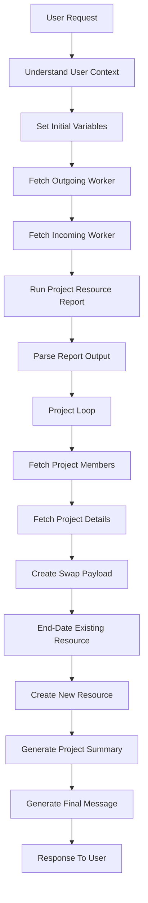

```mermaid
flowchart TD

A[User Request]

B[Understand User Context]

C[Set Initial Variables]

D[Fetch Outgoing Worker]

E[Fetch Incoming Worker]

F[Run Project Resource Report]

G[Parse Report Output]

H[Project Loop]

I[Fetch Project Members]

J[Fetch Project Details]

K[Create Swap Payload]

L[End-Date Existing Resource]

M[Create New Resource]

N[Generate Project Summary]

O[Generate Final Message]

P[Response To User]

A --> B
B --> C
C --> D
D --> E
E --> F
F --> G
G --> H

H --> I
I --> J
J --> K
K --> L
L --> M
M --> N

N --> O
O --> P
```
