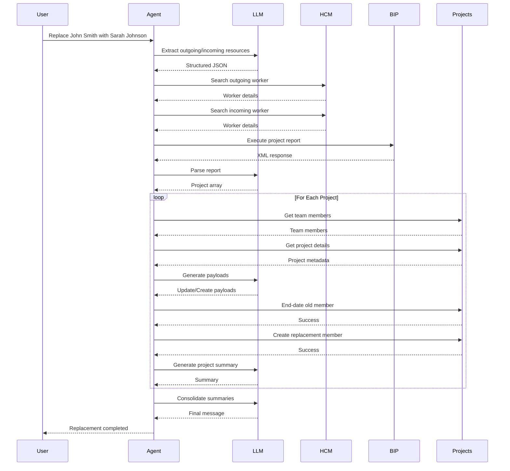

```mermaid
sequenceDiagram

participant User
participant Agent
participant LLM
participant HCM
participant BIP
participant Projects

User->>Agent: Replace John Smith with Sarah Johnson

Agent->>LLM: Extract outgoing/incoming resources

LLM-->>Agent: Structured JSON

Agent->>HCM: Search outgoing worker

HCM-->>Agent: Worker details

Agent->>HCM: Search incoming worker

HCM-->>Agent: Worker details

Agent->>BIP: Execute project report

BIP-->>Agent: XML response

Agent->>LLM: Parse report

LLM-->>Agent: Project array

loop For Each Project

Agent->>Projects: Get team members

Projects-->>Agent: Team members

Agent->>Projects: Get project details

Projects-->>Agent: Project metadata

Agent->>LLM: Generate payloads

LLM-->>Agent: Update/Create payloads

Agent->>Projects: End-date old member

Projects-->>Agent: Success

Agent->>Projects: Create replacement member

Projects-->>Agent: Success

Agent->>LLM: Generate project summary

LLM-->>Agent: Summary

end

Agent->>LLM: Consolidate summaries

LLM-->>Agent: Final message

Agent-->>User: Replacement completed
```
