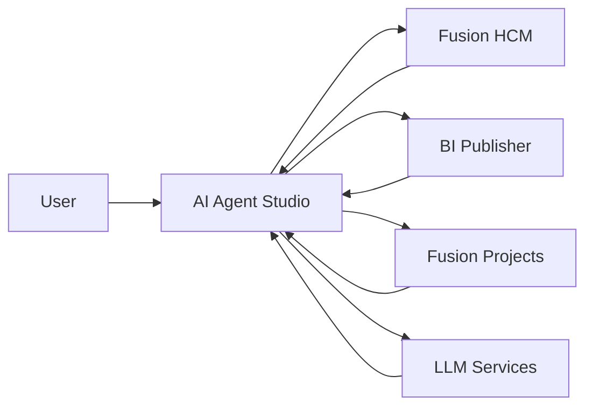
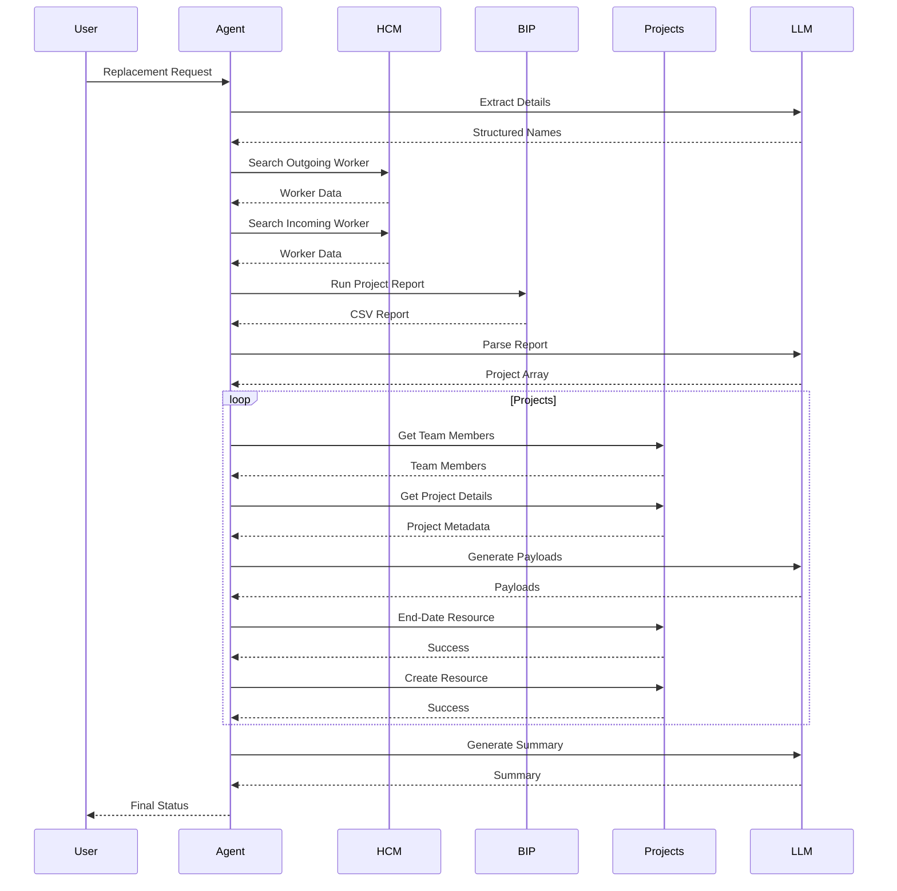

# Solution Architecture

## Architecture Overview

The Project Resource Replacement AI Agent orchestrates multiple Oracle Fusion services and AI components to automate project resource replacement.

The architecture combines:

* Oracle AI Agent Studio
* Oracle Fusion HCM
* Oracle Fusion Project Management
* Oracle BI Publisher
* Oracle Fusion REST APIs
* Large Language Models

---

## High-Level Architecture



---

## Component Responsibilities

### User Interface Layer

Receives natural language replacement requests.

Example:

```text
Replace Project Manager John Smith with Sarah Johnson
```

---

### AI Agent Studio Layer

Acts as the orchestration engine.

Responsibilities:

* Workflow execution
* Variable management
* Node orchestration
* Loop execution
* Tool invocation
* Response generation

---

### Oracle Fusion HCM Layer

Used to fetch worker identities.

Business Object:

```text
ORA_HCM_EMPINFO_SEARCHWORKER
```

Purpose:

* Locate worker records
* Retrieve worker information
* Retrieve email addresses

---

### Oracle BI Publisher Layer

Provides project discovery capability.

External Tool:

```text
PROJECT_RESOURCE_REPORT
```

Purpose:

* Identify projects associated with outgoing resource
* Return project assignment data

---

### Oracle Fusion Projects Layer

Used for project resourcing operations.

Business Objects:

```text
ORA_PRJ_ORAPRJCOMM_SEARCHPROJECT

ORA_PRJ_ORAPRJCOMM_PROJECTMEMBERSEARCH

ORA_PRJ_ORAPRJCOMM_PROJECTMEMBERUPDATE

ORA_PRJ_ORAPRJCOMM_PROJECTMEMBERCREATE
```

Responsibilities:

* Retrieve project details
* Retrieve team members
* End-date assignments
* Create assignments

---

### LLM Processing Layer

Used for:

#### Entity Extraction

Identify outgoing and incoming resources.

#### Report Transformation

Convert report output into structured JSON.

#### Payload Generation

Create update and create payloads.

#### Summary Generation

Generate human-readable outcomes.

---

## End-to-End Execution Flow


---

## Design Principles

### Reusability

Business logic is reusable across resource types.

### Scalability

Supports multiple project assignments.

### Maintainability

Uses standard Oracle Fusion APIs.

### Extensibility

Additional validations and approvals can be added.

### Governance

Updates occur through supported Oracle Fusion interfaces.

---

## Expected Outcome

The architecture provides an enterprise-grade automation framework for project resource transitions while leveraging Oracle Fusion as the system of record and Oracle AI Agent Studio as the orchestration platform.
