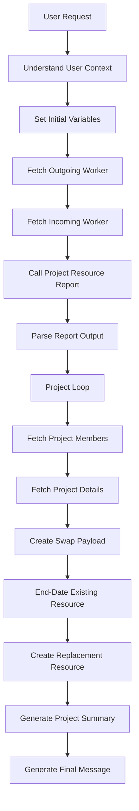

# Process Flow

## Overview

The Project Resource Replacement AI Agent follows a multi-stage orchestration pattern that combines Oracle Fusion HCM, Oracle Fusion Projects, BI Publisher, External REST integrations, and LLM-based processing.

The workflow is designed to identify an outgoing resource, discover impacted projects, perform resource replacement activities, and generate a consolidated execution summary.

---

# End-to-End Flow



---

# Step 1 – Understand User Context

## Objective

Interpret the natural language request and identify:

* Outgoing resource
* Incoming resource

## Sample Input

```text
Replace Project Manager John Smith with Sarah Johnson
```

## Sample Output

```json
{
  "status": "success",
  "outgoing_resource_name": "John Smith",
  "outgoing_resource_formatted": "%John%Smith%",
  "incoming_resource_name": "Sarah Johnson",
  "incoming_resource_formatted": "%Sarah%Johnson%"
}
```

## AI Pattern

Natural Language Entity Extraction

---

# Step 2 – Set Initial Variables

## Objective

Store extracted resources as workflow variables.

Variables:

```text
OldProjectMember
NewProjectMember
```

Purpose:

* Maintain state
* Reuse values throughout execution

---

# Step 3 – Fetch Outgoing Worker

## Objective

Resolve outgoing resource information from HCM.

Business Object:

```text
ORA_HCM_EMPINFO_SEARCHWORKER
```

Function:

```text
getall_workers
```

Input:

```text
%John%Smith%
```

Output:

```json
{
  "PersonId": "300000123",
  "PersonNumber": "100123",
  "EmailAddress": "john.smith@company.com"
}
```

---

# Step 4 – Fetch Incoming Worker

## Objective

Resolve incoming resource details.

Business Object:

```text
ORA_HCM_EMPINFO_SEARCHWORKER
```

Purpose:

* Validate worker exists
* Retrieve email address

---

# Step 5 – Call Project Resource Report

## Objective

Identify all projects assigned to outgoing resource.

Tool:

```text
PROJECT_RESOURCE_REPORT
```

Technology:

```text
BI Publisher SOAP Service
```

Input:

```text
Outgoing Worker Email Address
```

Output:

```text
CSV Report
```

---

# Step 6 – Parse Report Output

## Objective

Transform report output into structured data.

Activities:

### Extract Base64

Extract reportBytes content.

### Decode Content

Convert Base64 to CSV.

### Convert CSV

Generate JSON array.

Output Example:

```json
[
  {
    "PROJECT_ID":"300000111111111",
    "PROJECT_NAME":"ERP Program"
  }
]
```

---

# Step 7 – Project Loop

## Objective

Process all projects returned by the report.

Loop Type:

```text
PARALLEL
```

Benefits:

* Faster execution
* Improved scalability

---

# Step 8 – Fetch Project Members

## Objective

Retrieve active project team members.

Business Object:

```text
ORA_PRJ_ORAPRJCOMM_PROJECTMEMBERSEARCH
```

Function:

```text
getall_ProjectTeamMembers
```

Filter:

```text
FinishDate is null
```

Purpose:

Locate outgoing resource.

---

# Step 9 – Fetch Project Details

## Objective

Retrieve project metadata.

Business Object:

```text
ORA_PRJ_ORAPRJCOMM_SEARCHPROJECT
```

Information Retrieved:

* Project ID
* Project Name
* Project End Date

---

# Step 10 – Create Swap Payload

## Objective

Generate replacement payloads.

Activities:

### Identify Outgoing Resource

Match worker against project team.

### Determine Project Role

Examples:

```text
Project Manager
Team Member
Project Administrator
Project Coordinator
```

### Calculate Dates

Determine:

```text
FinishDate
StartDate
```

### Generate Payloads

Outgoing Payload

```json
{
  "ProjectId":"300000111",
  "TeamMemberId":"300000222",
  "FinishDate":"2026-06-13"
}
```

Incoming Payload

```json
{
  "PersonEmail":"sarah.johnson@company.com",
  "ProjectRole":"Project Manager",
  "StartDate":"2026-06-13"
}
```

---

# Step 11 – End-Date Existing Resource

## Objective

Remove outgoing resource assignment.

Business Object:

```text
ORA_PRJ_ORAPRJCOMM_PROJECTMEMBERUPDATE
```

Operation:

```text
PATCH
```

Payload:

```json
{
  "FinishDate":"2026-06-13"
}
```

---

# Step 12 – Create Replacement Resource

## Objective

Assign incoming resource.

Business Object:

```text
ORA_PRJ_ORAPRJCOMM_PROJECTMEMBERCREATE
```

Operation:

```text
POST
```

Purpose:

Create project team member.

---

# Step 13 – Generate Project Summary

## Objective

Create project-level audit summary.

Example:

```text
On ERP Program, John Smith was end-dated on 13-Jun-2026 and replaced by Sarah Johnson starting on 13-Jun-2026.
```

---

# Step 14 – Generate Final Message

## Objective

Aggregate all project summaries.

Example:

```text
Resource replacement completed successfully.

ERP Program:
John Smith was replaced by Sarah Johnson.

Finance Transformation:
John Smith was replaced by Sarah Johnson.

Cloud Migration:
John Smith was replaced by Sarah Johnson.
```

---

# Oracle AI Agent Studio Patterns Used

| Pattern                    | Usage |
| -------------------------- | ----- |
| Entity Extraction          | Yes   |
| Variable Management        | Yes   |
| Business Object Invocation | Yes   |
| External REST Integration  | Yes   |
| LLM Data Transformation    | Yes   |
| Dynamic Payload Generation | Yes   |
| Parallel Loop Processing   | Yes   |
| Human Readable Summaries   | Yes   |

---

# Execution Outcome

A single user request results in automated resource replacement across all impacted projects while preserving project role assignments and generating an execution summary.
