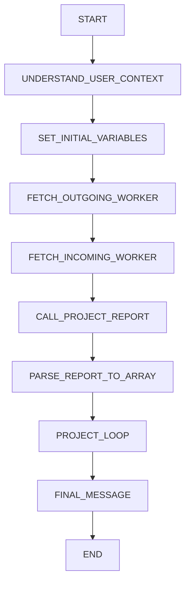
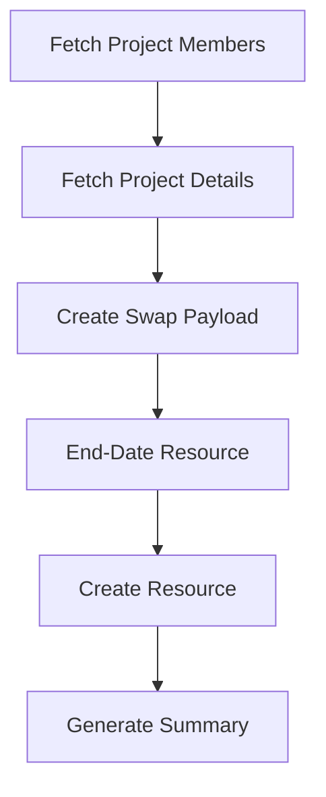

# Technical Design

## Overview

This document provides a node-level technical breakdown of the Project Resource Replacement AI Agent implementation.

The Ai Agent is implemented using an Oracle AI Agent Studio architecture.

---

# Workflow Metadata

| Property       | Value                          |
| -------------- | ------------------------------ |
| Workflow Name  | PROJECT_TEAM_REPLACEMENT_AGENT |
| Architecture   | Data Pipeline                  |
| Trigger Type   | REST                           |
| Human Approval | Disabled                       |
| Wait State     | Disabled                       |
| Loop Type      | Parallel                       |

---

# Data Pipeline Architecture



---

# Node Design

## UNDERSTAND_USER_CONTEXT

### Type

```text
LLM
```

### Purpose

Extract resources from natural language.

### Responsibilities

* Determine outgoing resource
* Determine incoming resource
* Remove role titles
* Generate wildcard search strings

### Output

```json
{
  "status":"success",
  "outgoing_resource_name":"",
  "incoming_resource_name":""
}
```

---

## SET_INITIAL_VARIABLES

### Type

```text
SET_FIELDS
```

### Variables

| Variable         | Purpose           |
| ---------------- | ----------------- |
| OldProjectMember | Outgoing resource |
| NewProjectMember | Incoming resource |

---

## FETCH_OUTGOING_WORKER

### Type

```text
BO_FUNCTION
```

### Business Object

```text
ORA_HCM_EMPINFO_SEARCHWORKER
```

### Function

```text
getall_workers
```

### REST Endpoint

```http
GET /hcmRestApi/resources/11.13.18.05/workers
```

### Purpose

Retrieve outgoing worker information.

---

## FETCH_INCOMING_WORKER

### Type

```text
BO_FUNCTION
```

### Purpose

Retrieve incoming worker details.

### Information Retrieved

* Person ID
* Person Number
* Email Address

---

## CALL_PROJECT_REPORT

### Type

```text
EXTERNAL_REST
```

### Tool

```text
PROJECT_RESOURCE_REPORT
```

### Protocol

```text
SOAP
```

### Purpose

Identify all projects associated with outgoing worker.

---

## PARSE_REPORT_TO_ARRAY

### Type

```text
LLM
```

### Responsibilities

1. Extract reportBytes
2. Decode Base64
3. Convert CSV
4. Generate JSON

### Input

```text
BI Publisher XML Response
```

### Output

```json
[
  {
    "PROJECT_ID":"",
    "PROJECT_NAME":""
  }
]
```

---

# Project Loop Design

## Loop Type

```text
PARALLEL
```

## Collection

```text
Parsed Project Array
```

Purpose:

Execute project replacements simultaneously.

---

# Nested Pipeline



---

# FETCH_PROJECT_MEMBERS

### Business Object

```text
ORA_PRJ_ORAPRJCOMM_PROJECTMEMBERSEARCH
```

### Function

```text
getall_ProjectTeamMembers
```

### Purpose

Retrieve active project members.

### Filter

```text
FinishDate is null
```

---

# FETCH_PROJECT_DETAILS

### Business Object

```text
ORA_PRJ_ORAPRJCOMM_SEARCHPROJECT
```

### Function

```text
getall_projects
```

### Purpose

Retrieve project metadata.

---

# CREATE_SWAP_PAYLOAD

### Type

```text
LLM
```

### Responsibilities

* Locate outgoing resource
* Identify role
* Calculate dates
* Generate payloads

### Output

```json
{
  "incoming_payload": {},
  "outgoing_payload": {}
}
```

---

# Date Calculation Logic

## Scenario 1

Project End Date = NULL

```text
Outgoing Finish Date = Current Date
Incoming Start Date = Current Date
```

---

## Scenario 2

Project End Date Exists

```text
Current Date < Project End Date
```

Result:

```text
Use Current Date
```

---

## Scenario 3

Current Date >= Project End Date

Result:

```text
Use Project End Date - 1 Day
```

Purpose:

Prevent assignments beyond project closure.

---

# END_DATE_OLD_MEMBER

### Business Object

```text
ORA_PRJ_ORAPRJCOMM_PROJECTMEMBERUPDATE
```

### Operation

```text
PATCH
```

### Purpose

End-date assignment.

---

# CREATE_NEW_PROJECT_TEAM_MEMBER

### Business Object

```text
ORA_PRJ_ORAPRJCOMM_PROJECTMEMBERCREATE
```

### Operation

```text
POST
```

### Purpose

Create replacement assignment.

---

# GENERATE_SUMMARY

### Type

```text
LLM
```

### Purpose

Create project-specific audit summary.

---

# FINAL_MESSAGE

### Type

```text
LLM
```

### Purpose

Generate final response.

### Input

* Original request
* Project summaries

### Output

Human-readable confirmation.

---

# Error Handling

Current Configuration:

```text
Email Error Handler
```

---

# Design Decisions

## Why HCM Worker Search?

Provides authoritative employee information.

---

## Why BI Publisher?

Efficient project discovery mechanism for given project manager.

---

## Why Parallel Processing?

Reduces overall execution time.

---

## Why Role Inheritance?

Preserves project staffing structure.

---

## Why LLM-Based Parsing?

Allows flexible transformation of report output.

---

# Oracle AI Agent Studio Patterns

| Pattern                    | Used |
| -------------------------- | ---- |
| Details Extraction         | Yes  |
| Data Transformation        | Yes  |
| External REST Integration  | Yes  |
| Nested Workflow            | Yes  |
| Parallel Looping           | Yes  |
| Dynamic Payload Generation | Yes  |
| Summary Generation         | Yes  |

---

# Technical Outcome

The AI Agent demonstrates enterprise orchestration across Oracle Fusion HCM, Oracle Fusion Projects, BI Publisher, REST services, and AI-driven decision-making within Oracle AI Agent Studio.
