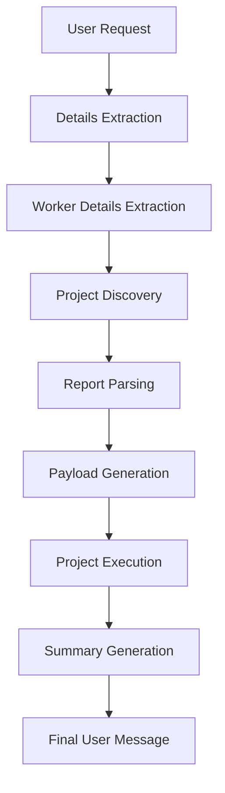

# AI Design and Prompts

## Overview

The Project Resource Replacement Ai Agent uses Large Language Models (LLMs) as orchestration components within Oracle AI Agent Studio.

The LLMs are responsible for:

* Details extraction
* Data transformation
* Payload generation
* Human-readable summarization

Unlike traditional deterministic workflows, the accelerator combines Oracle Fusion APIs with AI-powered reasoning to interpret user intent and dynamically generate execution payloads.

---

# AI Architecture



---

# AI Capability Matrix

| Capability             | Purpose                                  |
| ---------------------- | ---------------------------------------- |
| Details Extraction     | Identify outgoing and incoming resources |
| Context Interpretation | Determine replacement direction          |
| Data Transformation    | Convert report output to JSON            |
| Payload Construction   | Generate API payloads                    |
| Date Reasoning         | Calculate start and finish dates         |
| Summary Generation     | Produce user-friendly updates            |

---

# Prompt 1 – Understand User Context

## Objective

Extract outgoing and incoming resources from a natural language request.

---

## Supported Patterns

```text
replace [A] with [B]

replace [A] to [B]

replace Team Member [A] to Team Member [B]

replace Project Manager [A] to Project Manager [B]

swap out [A] for [B]

change PM from [A] to [B]

change Team Member from [A] to [B]

update [A] with [B]

move [A] to [B]
```

---

## Processing Logic

### Identify Outgoing Resource

Current project member to be removed.

### Identify Incoming Resource

Replacement resource to be assigned.

### Remove Titles

The prompt removes:

```text
Project Manager

Team Member

PM

TM
```

---

## Output Structure

```json
{
  "status":"success",
  "outgoing_resource_name":"John Smith",
  "outgoing_resource_formatted":"%John%Smith%",
  "incoming_resource_name":"Sarah Johnson",
  "incoming_resource_formatted":"%Sarah%Johnson%"
}
```

---

# AI Pattern Used

Entity Extraction Pattern

---

# Prompt 2 – Parse Report To Array

## Objective

Convert BI Publisher output into structured JSON.

---

## Input

The report returns:

```text
XML
  -> Base64
      -> CSV
```

---

## AI Responsibilities

### Extract Base64

Locate:

```xml
<ns2:reportBytes>
```

### Decode Content

Convert Base64 into CSV.

### Parse CSV

Create JSON array.

---

## Example Input

```csv
PROJECT_ID,PROJECT_NAME
300000111111,ERP Program
300000222222,Finance Program
```

---

## Example Output

```json
[
  {
    "PROJECT_ID":"300000111111",
    "PROJECT_NAME":"ERP Program"
  },
  {
    "PROJECT_ID":"300000222222",
    "PROJECT_NAME":"Finance Program"
  }
]
```

---

# AI Pattern Used

Data Transformation Pattern

---

# Prompt 3 – Create Swap Payload

## Objective

Generate Oracle Fusion API payloads dynamically.

---

## Inputs

### User Request

```text
Replace John Smith with Sarah Johnson
```

### Project Team Payload

Current project assignments.

### Incoming Worker Payload

Incoming worker information.

### Project Details

Project metadata.

### Current System Date

Workflow Current date.

---

## AI Responsibilities

### Identify Outgoing Resource

Locate matching team member.

### Determine Role

Examples:

```text
Project Manager

Project Administrator

Team Member

Project Coordinator
```

### Determine Dates

Calculate:

```text
FinishDate

StartDate
```

### Generate Payloads

Outgoing Payload:

```json
{
  "ProjectId":"300000111",
  "TeamMemberId":"300000222",
  "FinishDate":"2026-06-13"
}
```

Incoming Payload:

```json
{
  "PersonEmail":"sarah.johnson@company.com",
  "ProjectRole":"Project Manager",
  "StartDate":"2026-06-13"
}
```

---

# Date Calculation Logic

## Scenario 1

Project End Date = NULL

```text
FinishDate = Current Date

StartDate = Current Date
```

---

## Scenario 2

Current Date Before Project End Date

```text
Use Current Date
```

---

## Scenario 3

Current Date Greater Than Project End Date

```text
Use Project End Date - 1 Day
```

---

# AI Pattern Used

Dynamic Payload Generation Pattern

---

# Prompt 4 – Generate Summary

## Objective

Create project-level audit summaries.

---

## Inputs

### Project Details

### Update Response

### Create Response

---

## Example Output

```text
On ERP Program, John Smith was end-dated on 13-Jun-2026 and replaced by Sarah Johnson starting on 13-Jun-2026.
```

---

# AI Pattern Used

Narrative Summary Generation

---

# Prompt 5 – Final Message

## Objective

Generate consolidated execution results.

---

## Inputs

### Original User Request

### Project-Level Summaries

---

## Example Output

```text
Project resource replacement completed successfully.

ERP Program:
John Smith was replaced by Sarah Johnson.

Finance Program:
John Smith was replaced by Sarah Johnson.
```

---

# AI Design Principles

## Structured Outputs

All prompts return machine-readable outputs.

---

## Explicit Instructions

Prompts specify:

* Expected format
* Required fields
* Error handling
* Output constraints

---

## JSON First Design

Every downstream process relies on structured JSON outputs.

---

## Deterministic Prompting

Prompts explicitly define:

* Input interpretation
* Response format
* Success criteria

to reduce hallucinations.

---

# AI Patterns Demonstrated

| Pattern                | Usage |
| ---------------------- | ----- |
| Details Extraction     | Yes   |
| Context Interpretation | Yes   |
| Data Transformation    | Yes   |
| JSON Generation        | Yes   |
| Payload Generation     | Yes   |
| Date Reasoning         | Yes   |
| Narrative Generation   | Yes   |

---

# Key Takeaways

The AI Agent demonstrates how LLMs can be integrated into Oracle Fusion business processes not merely for conversation, but as orchestration components responsible for interpretation, transformation, decision support, and execution payload generation.
