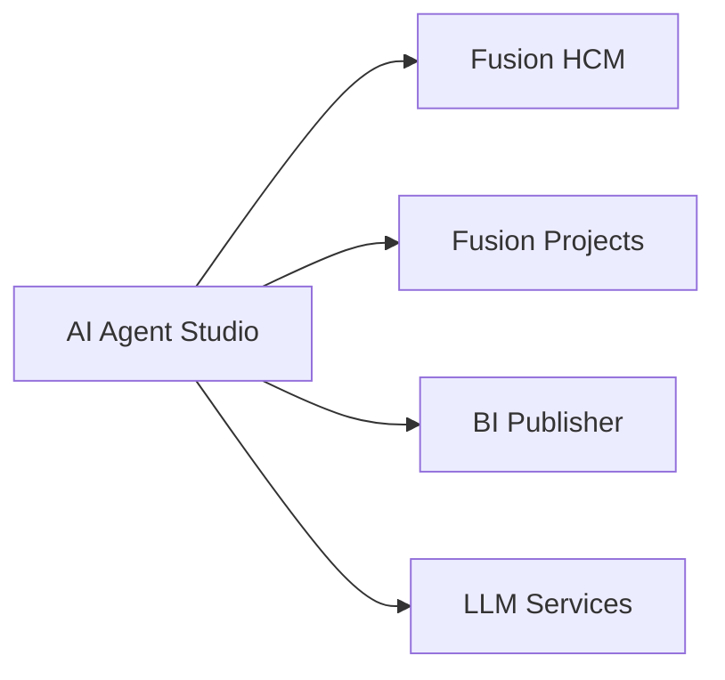
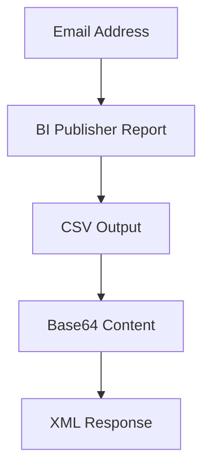
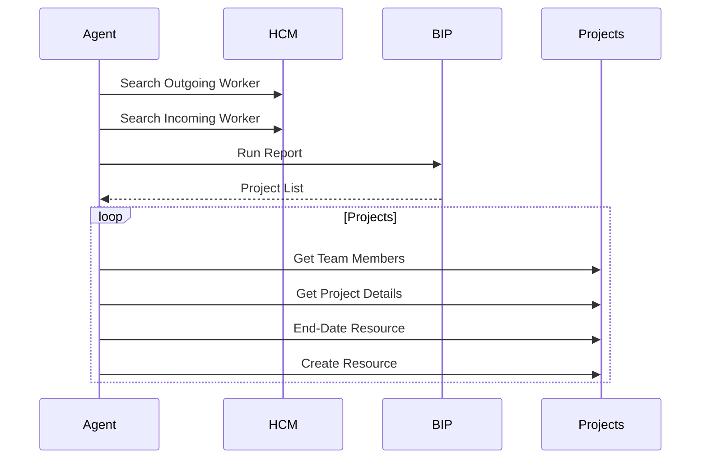

# API and Integration Reference

## Overview

The Project Resource Replacement AI Agent integrates Oracle Fusion HCM, Oracle Fusion Project Management, Oracle BI Publisher, and Oracle AI Agent Studio.

This document provides a complete reference for all APIs, Business Objects, and external integrations used by the accelerator.

---

# Integration Landscape



---

# HCM Integration

## Business Object

```text
ORA_HCM_EMPINFO_SEARCHWORKER
```

---

## Function

```text
getall_workers
```

---

## REST Endpoint

```http
GET /hcmRestApi/resources/11.13.18.05/workers
```

---

## Query

```http
?q=DisplayName LIKE '{personname}'
```

---

## Purpose

Retrieve:

* Person ID
* Person Number
* Email Address

---

## Sample Request

```http
GET /workers?q=DisplayName LIKE '%John%Smith%'
```

---

## Sample Response

```json
{
  "PersonId":"300000123456",
  "PersonNumber":"100123",
  "emails":[
    {
      "EmailAddress":"john.smith@company.com"
    }
  ]
}
```

---

# Project Team Search

## Business Object

```text
ORA_PRJ_ORAPRJCOMM_PROJECTMEMBERSEARCH
```

---

## Function

```text
getall_ProjectTeamMembers
```

---

## Endpoint

```http
GET /fscmRestApi/resources/11.13.18.05/projects/{ProjectId}/child/ProjectTeamMembers
```

---

## Filter

```http
FinishDate is null
```

---

## Purpose

Retrieve active project assignments.

---

# Project Search

## Business Object

```text
ORA_PRJ_ORAPRJCOMM_SEARCHPROJECT
```

---

## Function

```text
getall_projects
```

---

## Endpoint

```http
GET /fscmRestApi/resources/11.13.18.05/projects/{ProjectId}
```

---

## Purpose

Retrieve:

* Project Name
* Project End Date
* Project Metadata

---

# Project Team Member Update

## Business Object

```text
ORA_PRJ_ORAPRJCOMM_PROJECTMEMBERUPDATE
```

---

## Function

```text
update_ProjectTeamMembers
```

---

## Operation

```http
PATCH
```

---

## Endpoint

```http
PATCH /projects/{ProjectId}/child/ProjectTeamMembers/{TeamMemberId}
```

---

## Sample Payload

```json
{
  "FinishDate":"2026-06-13"
}
```

---

## Purpose

End-date outgoing resource.

---

# Project Team Member Create

## Business Object

```text
ORA_PRJ_ORAPRJCOMM_PROJECTMEMBERCREATE
```

---

## Function

```text
create_ProjectTeamMembers
```

---

## Operation

```http
POST
```

---

## Endpoint

```http
POST /projects/{ProjectId}/child/ProjectTeamMembers
```

---

## Sample Payload

```json
{
  "PersonEmail":"sarah.johnson@company.com",
  "ProjectRole":"Project Manager",
  "StartDate":"2026-06-13"
}
```

---

## Purpose

Create replacement assignment.

---

# External Integration

## Tool Name

```text
PROJECT_RESOURCE_REPORT
```

---

## Integration Type

```text
EXTERNAL_REST
```

---

## Protocol

```text
SOAP
```

---

## Endpoint

```text
/xmlpserver/services/ExternalReportWSSService
```

---

## Report

```text
/Custom/Financials/Project Reporting.xdo
```

---

## Input Parameter

```text
P_EMAIL_ADDRESS
```

---

## Purpose

Discover all projects associated with outgoing resource.

---

# BI Publisher Data Flow



---

# LLM Integrations

## Entity Extraction

Purpose:

```text
Identify outgoing and incoming resources.
```

---

## Report Parsing

Purpose:

```text
Convert XML/Base64/CSV to JSON.
```

---

## Payload Generation

Purpose:

```text
Generate Oracle Fusion update and create payloads.
```

---

## Summary Generation

Purpose:

```text
Generate audit summaries.
```

---

# Oracle AI Agent Studio Integration Patterns

| Pattern                    | Usage |
| -------------------------- | ----- |
| Business Object Invocation | Yes   |
| External REST Integration  | Yes   |
| SOAP Integration           | Yes   |
| REST Integration           | Yes   |
| Dynamic Payload Generation | Yes   |
| Parallel Processing        | Yes   |

---

# Integration Dependencies

## Oracle Fusion HCM

Required for worker details.

---

## Oracle Fusion Projects

Required for assignment updates.

---

## Oracle BI Publisher

Required for project discovery.

---

## Oracle AI Agent Studio

Required for orchestration.

---

## LLM Services

Required for reasoning and transformations.

---

# API Execution Sequence



---

# AI Agent Outcome

The AI Agent orchestrates multiple Oracle Fusion services and external integrations to automate project resource replacement while preserving project roles.
