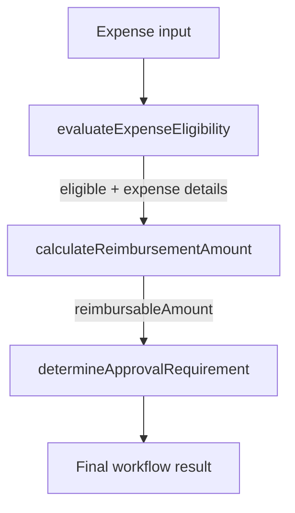

# Oracle Fusion AI Agent Studio — Policy Builder

A companion repository for the **Policy Builder / Policy Nodes** walkthrough. This demo shows how a written expense reimbursement policy can be translated into three independent, deterministic functions and orchestrated in an Oracle Fusion AI Agent Studio Workflow Agent.

> **Demo only:** GlobalTech and the reimbursement rules are illustrative. This repository is an implementation reference, not an Oracle product certification, production policy, or substitute for reviewing generated logic in your target environment.

## Video

▶️ [Watch the Policy Builder walkthrough on YouTube](https://youtu.be/RqiYNRQjp3I)

## What’s included

| Path | Description |
|---|---|
| `policy/globaltech-expense-reimbursement-policy.md` | Source policy document used in the demo |
| `prompts/policy-builder-generation-prompt.md` | Generation prompt with exact function schemas and implementation constraints |
| `docs/solution-overview.md` | Design, orchestration flow, and implementation notes |
| `examples/sample-inputs.json` | Representative input scenarios |

## Policy function design

The prompt requests exactly three independently callable functions:

1. `evaluateExpenseEligibility` — checks submission eligibility and returns `eligible`, `decision`, and `reasonCode`.
2. `calculateReimbursementAmount` — applies category caps using the supplied eligibility result and returns `reimbursableAmount`, `amountDecision`, and `limitApplied`.
3. `determineApprovalRequirement` — selects the approval tier using the reimbursable amount and returns `approvalRequired` and `approvalLevel`.

The functions are chained in this order:



## Policy highlights

- Expense status must be `SUBMITTED`; business purpose must be non-empty.
- Expense amount must be greater than zero.
- Expense date must be no more than 60 calendar days before submission.
- `PERSONAL`, `ALCOHOL`, `FINES`, and `PERSONAL_ENTERTAINMENT` are excluded.
- A receipt is required only when the amount is **greater than 25 USD**.
- Caps: `MEAL` 75 USD, `HOTEL` 250 USD, `GROUND_TRANSPORTATION` 100 USD. Other eligible business expenses are reimbursed at the submitted amount.
- Approval uses the **reimbursable amount**: below 500 USD → `MANAGER`; 500 to below 2,000 USD → `FINANCE_MANAGER`; 2,000 USD or more → `FINANCE_DIRECTOR`.

See the full source policy for all requirements and boundary conditions.

## Suggested walkthrough

1. Review the policy document and identify eligibility, reimbursement, and approval rules.
2. Provide the generation prompt to Policy Builder.
3. Inspect the three generated functions and confirm exact names, parameters, types, and outputs.
4. Review deterministic logic, null handling, and precedence when multiple eligibility rules fail.
5. Test threshold boundaries and chain the functions in a Workflow Agent.
6. Validate the generated artifacts in your own AI Agent Studio environment before using them beyond a demo.

## Important validation notes

- The policy defines allowed reason codes but does not prescribe a complete precedence order for multiple simultaneous failures. The prompt asks for a deterministic precedence; review the generated choice and document it.
- Confirm how your target environment represents nulls, numbers, booleans, dates, and function outputs.
- Verify that `receiptProvided = false` remains a valid Boolean value.
- The approval function should consume `reimbursableAmount`, not the original expense amount.
- The supplied prompt requires null/invalid handling without inventing defaults. Confirm behavior for invalid category/date/amount inputs during testing.
- These sample expected results are illustrative acceptance checks. They are not proof that a particular generated implementation has passed execution in your tenant.

## Repository structure

```text
.
├── README.md
├── policy/
│   └── globaltech-expense-reimbursement-policy.md
├── prompts/
│   └── policy-builder-generation-prompt.md
├── docs/
│   └── solution-overview.md
├── examples/
│   └── sample-inputs.json
```

## Disclaimer

Oracle Fusion AI Agent Studio capabilities and UI may vary by release and configuration. Follow your organization's security, change-management, and financial-control processes. Do not use illustrative policy rules for real employee reimbursements without formal policy approval.

## License

The included policy and prompt are provided for demonstration and learning. Add a repository license only if you have the rights and intend to grant reuse permissions.
